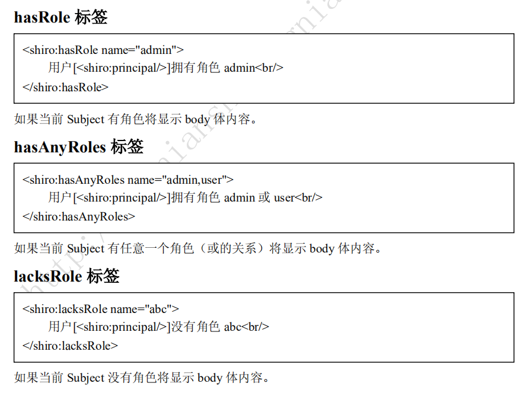

```java
		DefaultSecurityManager securityManager = new DefaultSecurityManager();

        //设置authenticator 认证者；认证器
		// 用于设置用于对取得Realm中验证数据要使用何种策略
        ModularRealmAuthenticator authenticator = new ModularRealmAuthenticator();
        authenticator.setAuthenticationStrategy(new AtLeastOneSuccessfulStrategy());
        securityManager.setAuthenticator(authenticator);

        //设置authorizer 核准人；授权人
		// 将权限字符串转化为 Permission 对象
        ModularRealmAuthorizer authorizer = new ModularRealmAuthorizer();
        authorizer.setPermissionResolver(new WildcardPermissionResolver());
        securityManager.setAuthorizer(authorizer);

        //设置Realm 从哪个领域中获得资源
        DruidDataSource ds = new DruidDataSource();
        ds.setDriverClassName("com.mysql.jdbc.Driver");
        ds.setUrl("jdbc:mysql://localhost:3306/shiro");
        ds.setUsername("root");
        ds.setPassword("");

        JdbcRealm jdbcRealm = new JdbcRealm();
        jdbcRealm.setDataSource(ds);
        jdbcRealm.setPermissionsLookupEnabled(true);
        securityManager.setRealms(Arrays.asList((Realm) jdbcRealm));

        //将SecurityManager设置到SecurityUtils 方便全局使用
        SecurityUtils.setSecurityManager(securityManager);

        Subject subject = SecurityUtils.getSubject();

        UsernamePasswordToken token = new UsernamePasswordToken("zhang", "123");
        subject.login(token);

        Assert.assertTrue(subject.isAuthenticated());
```

Subject 作为一名用户，线程安全

**用户 ，角色，权限**

即用户-角色之间是多对多关系，角色-权限之间是多对多关系；且用户和权限之间通过角 

色建立关系；在系统中验证时通过权限验证，角色只是权限集合，即所谓的显示角色；其 

实权限应该对应到资源（如菜单、URL、页面按钮、Java 方法等）中，即应该将权限字符 

串存储到资源实体中。


系统启动后，开启任务从数据库指定表中，初始化角色和权限到缓存(Redis)中。

获取身份验证信息（`doGetAuthenticationInfo`）及授权信息（`doGetAuthorizationInfo`）；

```java
public class UserRealm extends AuthorizingRealm { 
     private UserService userService = new UserServiceImpl(); 
    //授权信息，就是将用户所拥有的角色还有许可进行初始化
     protected AuthorizationInfo doGetAuthorizationInfo(PrincipalCollection principals) { 
         String username = (String)principals.getPrimaryPrincipal(); 
         SimpleAuthorizationInfo authorizationInfo = new SimpleAuthorizationInfo(); 
         authorizationInfo.setRoles(userService.findRoles(username)); 
         authorizationInfo.setStringPermissions(userService.findPermissions(username)); 
         return authorizationInfo; 
     } 
     protected AuthenticationInfo doGetAuthenticationInfo(AuthenticationToken token) throws 
    AuthenticationException { 
     String username = (String)token.getPrincipal(); 
     User user = userService.findByUsername(username); 
     if(user == null) { 
     	throw new UnknownAccountException();//没找到帐号
     } 
     if(Boolean.TRUE.equals(user.getLocked())) { 
     	throw new LockedAccountException(); //帐号锁定
     } 
     //交给 AuthenticatingRealm 使用 CredentialsMatcher 进行密码匹配，如果觉得人家 的不好可以在此判断或自定义实现
     SimpleAuthenticationInfo authenticationInfo = new SimpleAuthenticationInfo( 
     user.getUsername(), //用户名
     user.getPassword(), //密码
     ByteSource.Util.bytes(user.getCredentialsSalt()),//salt=username+salt 
     	getName() //realm name 
     ); 
     return authenticationInfo; 
     } 
}
```


#### AuthenticationToken


只是一个认证的对象，里面封住了一些简单的字符串信息，可以是密匙也可以是用户名密码

#### AuthenticationInfo


AuthenticationInfo 有两个作用： 

1、如果 Realm 是 AuthenticatingRealm 子类，则提供给 AuthenticatingRealm 内部使用的 CredentialsMatcher 进行凭据验证；（如果没有继承它需要在自己的 Realm 中自己实现验证）； 

2、提供给 SecurityManager 来创建 Subject（提供身份信息）；

#### PrincipalCollection


因为我们可以在 Shiro 中同时配置多个 Realm，所以呢身份信息可能就有多个；因此其提供 了PrincipalCollection 用于聚合这些身份信息： 

```java
public interface PrincipalCollection extends Iterable, Serializable { 
    Object getPrimaryPrincipal(); //得到主要的身份
    <T> T oneByType(Class<T> type); //根据身份类型获取第一个
    <T> Collection<T> byType(Class<T> type); //根据身份类型获取一组 List asList(); //转换为 List 
    Set asSet(); //转换为 Set 
    Collection fromRealm(String realmName); //根据 Realm 名字获取
    Set<String> getRealmNames(); //获取所有身份验证通过的 Realm 名字
     boolean isEmpty(); //判断是否为空
}
/*
因为 PrincipalCollection 聚合了多个，此处最需要注意的是 getPrimaryPrincipal，如果只有一
个 Principal 那么直接返回即可，如果有多个 Principal，则返回第一个（因为内部使用 Map
存储，所以可以认为是返回任意一个）；oneByType / byType 根据凭据的类型返回相应的
Principal；fromRealm 根据 Realm 名字（每个 Principal 都与一个 Realm 关联）获取相应的
Principal。
*/
```

#### AuthorizationInfo

AuthorizationInfo 用于聚合授权信息的： 当一个用户登录成功后，将角色和权限封装成一个AuthrizationInfo对象。

```java
public interface AuthorizationInfo extends Serializable { 
 Collection<String> getRoles(); //获取角色字符串信息
 Collection<String> getStringPermissions(); //获取权限字符串信息
 Collection<Permission> getObjectPermissions(); //获取 Permission 对象信息
}
```

####  Subject

Subject 是 Shiro 的核心对象，基本所有身份验证、授权都是通过 Subject 完成。、

```java
// 身份信息获取
Object getPrincipal(); //Primary Principal 
PrincipalCollection getPrincipals(); // PrincipalCollection

// 身份验证
void login(AuthenticationToken token) throws AuthenticationException; 
boolean isAuthenticated(); 
boolean isRemembered();
/*
通过 login 登录，如果登录失败将抛出相应的 AuthenticationException，如果登录成功调用 isAuthenticated 就会返回 true，即已经通过身份验证；如果 isRemembered 返回 true，表示是
通过记住我功能登录的而不是调用 login 方法登录的。isAuthenticated/isRemembered 是互斥
的，即如果其中一个返回 true，另一个返回 false。
*/
//角色授权验证
boolean hasRole(String roleIdentifier); 
boolean[] hasRoles(List<String> roleIdentifiers); 
boolean hasAllRoles(Collection<String> roleIdentifiers); 
void checkRole(String roleIdentifier) throws AuthorizationException; 
void checkRoles(Collection<String> roleIdentifiers) throws AuthorizationException; 
void checkRoles(String... roleIdentifiers) throws AuthorizationException;
/*
hasRole*进行角色验证，验证后返回 true/false；而 checkRole*验证失败时抛出 AuthorizationException 异常。
*/
//权限授权验证
boolean isPermitted(String permission); 
boolean isPermitted(Permission permission); 
boolean[] isPermitted(String... permissions); 
boolean[] isPermitted(List<Permission> permissions); 
boolean isPermittedAll(String... permissions); 
boolean isPermittedAll(Collection<Permission> permissions); 
void checkPermission(String permission) throws AuthorizationException; 
void checkPermission(Permission permission) throws AuthorizationException; 
void checkPermissions(String... permissions) throws AuthorizationException; 
void checkPermissions(Collection<Permission> permissions) throws AuthorizationException;
//会话
Session getSession(); //相当于 getSession(true) 
Session getSession(boolean create);
/*
类似于 Web 中的会话。如果登录成功就相当于建立了会话，接着可以使用 getSession 获取；
如果 create=true 如果没有会话将返回 null，而 create=true 如果没有会话会强制创建一个。
*/
//退出
void logout();
//RunAs
void runAs(PrincipalCollection principals) throws NullPointerException, IllegalStateException; 
boolean isRunAs(); 
PrincipalCollection getPreviousPrincipals(); 
PrincipalCollection releaseRunAs();
/*
RunAs 即实现“允许 A 假设为 B 身份进行访问”；通过调用 subject.runAs(b)进行访问；接
着调用 subject.getPrincipals 将获取到 B 的身份；此时调用 isRunAs 将返回 true；而 a 的身
份需要通过 subject. getPreviousPrincipals 获取；如果不需要 RunAs 了调用 subject. 
releaseRunAs 即可。
*/
// 多线程
<V> V execute(Callable<V> callable) throws ExecutionException; 
void execute(Runnable runnable); 
<V> Callable<V> associateWith(Callable<V> callable); 
Runnable associateWith(Runnable runnable);
/*
实现线程之间的 Subject 传播，因为 Subject 是线程绑定的；因此在多线程执行中需要传播
到相应的线程才能获取到相应的 Subject。最简单的办法就是通过 execute(runnable/callable
实例)直接调用；或者通过 associateWith(runnable/callable 实例)得到一个包装后的实例；它 们都是通过：1、把当前线程的 Subject 绑定过去；2、在线程执行结束后自动释放。
*/
```

对于 Subject 我们一般这么使用： 

1、身份验证（login）

2、授权（hasRole/isPermitted或checkRole/checkPermission）

3、将相应的数据存储到会话（Session）

4、切换身份（RunAs）多线程身份传播

5、退出 


#### Web继承的拦截器模块

```ini
[urls] 
/role=authc,roles[admin] 
/permission=authc,perms["user:create"]
#roles 是 org.apache.shiro.web.filter.authz.RolesAuthorizationFilter 类型的实例，通过参数指定访问时需要的角色，如“[admin]”
#Perms 是 org.apache.shiro.web.filter.authz.PermissionsAuthorizationFilter 类型的实
#例，和 roles 类似，只是验证权限字符串。
#authc 是 org.apache.shiro.web.filter.authc.FormAuthenticationFilter 类型的实例，其用于实 现基于表单的身份验证；
```


#### 常用标签

```xml
<shiro:guest> 
欢迎游客访问，<a href="${pageContext.request.contextPath}/login.jsp">登录</a> 
</shiro:guest>
<!--用户没有身份验证时显示相应信息，即游客访问信息。-->
<shiro:user> 
欢迎[<shiro:principal/>]登录，<a href="${pageContext.request.contextPath}/logout">退出</a>
</shiro:user>
<!--用户已经身份验证/记住我登录后显示相应的信息。-->
<shiro:authenticated> 
 用户[<shiro:principal/>]已身份验证通过 
</shiro:authenticated>
<!--用户已经身份验证通过，即 Subject.login 登录成功，不是记住我登录的。-->
<shiro:notAuthenticated> 
 未身份验证（包括记住我） 
</shiro:notAuthenticated>
<!--
用户已经身份验证通过，即没有调用 Subject.login 进行登录，包括记住我自动登录的也属 于未进行身份验证。
-->
```




```xml
<shiro:hasPermission name="user:create"> 
 用户[<shiro:principal/>]拥有权限 user:create<br/> 
</shiro:hasPermission>
<!--如果当前 Subject 有权限将显示 body 体内容。-->
<shiro:lacksPermission name="org:create"> 
 用户[<shiro:principal/>]没有权限 org:create<br/> 
</shiro:lacksPermission>
<!--如果当前 Subject 没有权限将显示 body 体内容。。-->
```

